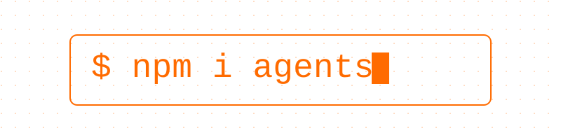

# IKEA Agent Hack — starter template



This is [`agents-starter`](https://github.com/cloudflare/agents-starter) — a working AI
chat agent on Cloudflare, no API key required — plus the additions made for the **IKEA Agent
Hack**:

1. **`POST /api/chat`** in `src/server.ts` — a plain JSON endpoint (`{ "message": "..." }` →
   `{ "reply": "..." }`) that uses the same tool definitions as the chat UI. You can `curl` it, and
   Step 6's shields (optional) are tested through it. (It is the same agent as the chat page, with no
   chat history per call: see "Two ways to talk to the agent".)
2. **`AI_GATEWAY_ID`** in `wrangler.jsonc` — every model call goes through your account's
   gateway (`agent-gateway`), which you create once in the dashboard (see "Create your AI Gateway"
   below), so Shield 1 is a few clicks.
3. **`src/mcp.ts`** — a small MCP server at `/mcp` with one `ask_agent` tool. It is what you
   lock down in Step 6's Secure MCP shield (optional).
4. A **commented `requireApproval` example** in `src/server.ts` (search for
   `issueGoodwillCredit`) — a starting point for a human approval gate on a real action.
5. An **`AGENTS.md`** for your coding agent: it ends every change with a prompt for you to test, and
   sends you to the dashboard to see what it built (for Workflows, the step diagram).
6. A `wrangler.jsonc` with your team's names filled in, the extra bindings (D1, R2, KV, Workflows,
   AI Search, Browser Run) commented in with the same names every team uses, and
   **`npm run check:team`**, a small check that your account id and hostname are set.

**Start here:** [Step 0: Get set up](https://ikea.events-cloudflare.com/hack/setup), then
[Step 1: Launch your first agent](https://ikea.events-cloudflare.com/hack/steps/1-deploy). The guided
path has seven steps and each one stands on its own. For ideas, see the
[Idea Gallery](https://ikea.events-cloudflare.com/hack/ideas); the optional
[Scoping helper](https://ikea.events-cloudflare.com/hack/scope) turns an idea into a plan mapped to the
steps.

## Quick start

You already have this folder from the event's starter download. Do not run
`npm create cloudflare` on top of it: that fetches stock `agents-starter` and **loses every
addition above**.

**1. Set your two team values.** Every team builds in its **own Cloudflare account** and every
account uses the **same names**, so everything in `wrangler.jsonc` is already filled in except two
values. Both are on your team card (the Workspace page of the event site). Edit these two fields,
nothing else:

```jsonc
"account_id": "TEAM_ACCOUNT_ID",
"routes": [{ "pattern": "TEAM_HOSTNAME", "custom_domain": true }],
```

Replace those two lines in place (keep the comma at the end of each) instead of pasting over the whole file, so the Durable Object and binding
settings survive. `npm run check:team` (it runs before `npm run dev` and `npm run deploy`) tells you if
a placeholder is still there, or if an old account id is set in your terminal (it only warns about an old API token, which overrides your login, so remove it).

**2. Create your AI Gateway.** Your account starts empty, and so does its AI Gateway list. In the
Cloudflare dashboard (your team account, top left): **AI** > **AI Gateway** > **Create custom gateway**, set the Gateway ID to
`agent-gateway` exactly (not the `default` gateway), leave the defaults, **Create**. Until it exists every model call fails
with error `2001` (`POST /api/chat` answers `gateway_not_configured`; the chat page may just stay
silent, `npx wrangler tail` shows the reason). No redeploy is needed once it exists. `wrangler` cannot
create it: its login has no AI Gateway permission.

**3. Run it.**

```bash
npm install
npm run dev
```

> **Cloudflare authentication is required to run locally.** This starter uses Workers AI
> with `"ai": { "remote": true }` in `wrangler.jsonc`, and Workers AI has no local
> simulator, so `npm run dev` opens a remote proxy session against the account in `account_id` and
> needs you to be signed in as a member of it. Run `npx wrangler login` once in an interactive
> terminal with the email your team's Cloudflare invitation went to. Check `npx wrangler whoami`
> lists your team account.

Open [http://localhost:5173](http://localhost:5173) to see your agent in action.

## Why there is no public workers.dev URL by default

`workers_dev` and `preview_urls` are **off by default** here (unlike stock
`agents-starter`), so Step 6's WAF exercise has exactly one hostname to protect. Disabling them does
**not** make the agent private: your demo hostname is also public by default, and the chat agent can
call tools with no login of its own. Use synthetic data only. `npm run dev` never needs a public URL.
If a host asks you to debug against a `workers.dev` URL, set `"workers_dev": true` temporarily and
turn it back off afterwards.

## Names in your account

Every team account uses these names, so every example works unchanged:

|                                     |                                                                    |
| ----------------------------------- | ------------------------------------------------------------------ |
| Worker (`name` in `wrangler.jsonc`) | `agent`                                                            |
| AI Gateway (`AI_GATEWAY_ID`)        | `agent-gateway` (you create it)                                    |
| R2 bucket (Step 4, if you use it)   | `agent-files`                                                      |
| AI Search (Step 4, if you use it)   | `agent-docs`                                                       |
| Workflow (Step 4, if you use it)    | `agent-workflow`                                                   |
| D1 database (an option)             | `agent-db`                                                         |
| Your account id and demo hostname   | on your team card (`agent.` + your zone): the only two that differ |

**Never** put a Custom Domain on `ikea.events-cloudflare.com`: that is the event site, not your account.

## Two ways to talk to the agent

One agent (the `ChatAgent` instance named `default`), two doors, plus a small separate MCP server:

| Surface          | How you reach it                    | What it is                                                                                                                                                  |
| ---------------- | ----------------------------------- | ----------------------------------------------------------------------------------------------------------------------------------------------------------- |
| Browser chat     | The page at your demo hostname      | A WebSocket to the agent. Streams, keeps the conversation (up to 100 messages), shows Approve/Reject cards.                                                 |
| `POST /api/chat` | `curl` or a script                  | One JSON reply from the **same** agent. Same tools, notes, schedules and workflows; each call is a one-off question with no history, and approvals end the turn. |
| `/mcp`           | An MCP client (Step 6's Secure MCP) | A separate, stateless MCP server with one `ask_agent` tool. It makes its own single model call: it does **not** call the chat agent's tools or memory.      |

So a note saved through `/api/chat` is there in the browser chat too. A WAF rule tested against `/api/chat`
shows how that route behaves, not that the browser chat (a WebSocket) is covered.

## Project structure

```
src/
  server.ts    # Chat agent + POST /api/chat + the commented requireApproval example
  mcp.ts       # a small MCP server (one ask_agent tool) at /mcp
  app.tsx      # Chat UI built with Kumo components (agents-starter, unmodified)
  client.tsx   # React entry point (agents-starter, unmodified)
  styles.css   # Tailwind + Kumo styles (agents-starter, unmodified)
scripts/
  check-team.mjs  # `npm run check:team`: account id, hostname and stale-setting check
```

## Test the chat endpoint

Set your demo URL once per terminal (the team card shows it ready to copy; replace `TEAM_HOSTNAME` with your demo hostname), then reuse it:

```bash
# macOS / Linux
export DEMO_URL=https://TEAM_HOSTNAME
curl -X POST "$DEMO_URL/api/chat" \
  -H 'content-type: application/json' -d '{"message":"hello"}'

# Windows PowerShell
$env:DEMO_URL = "https://TEAM_HOSTNAME"
Invoke-RestMethod -Method Post -Uri "$env:DEMO_URL/api/chat" -ContentType 'application/json' -Body '{"message":"hello"}'
```

When a shield blocks a request, the endpoint returns `403` with `{ "blocked": true, "code": ... }`
so a `curl` can tell blocked from answered.

## Add a human approval gate

`src/server.ts`'s `calculate` tool demonstrates the pattern (`needsApproval` gates any
calculation over 1000). Right below it, a commented `issueGoodwillCredit` example is a
closer template for a real action. For gating a whole durable pipeline, see Workflows
`waitForEvent` in the [Platform Guide](https://ikea.events-cloudflare.com/hack/platform/full-stack).

## Deploy

```bash
npm run deploy
```

Your account is empty, so the first deploy **creates** the Worker `agent` and the Custom Domain from
`routes`. Cloudflare then adds the DNS record and certificate, which can take a few minutes: until
then your laptop may say the host does not exist or show a certificate error. Run `npm run deploy`
again if it was interrupted; it is safe to repeat. Wrangler may print "No targets deployed"; that is
fine. A "Could not find zone" error means `account_id` and the hostname do not belong together.

## Learn more

- The event's [Platform Guide](https://ikea.events-cloudflare.com/hack/platform) — every
  primitive on one map, with snippets
- The [Idea Gallery](https://ikea.events-cloudflare.com/hack/ideas)
- [Secure it, in full](https://ikea.events-cloudflare.com/hack/secure) — Step 6 (optional)
- [Agents SDK documentation](https://developers.cloudflare.com/agents/)
- [Model Context Protocol on Cloudflare](https://developers.cloudflare.com/agents/model-context-protocol/)

## License

MIT
